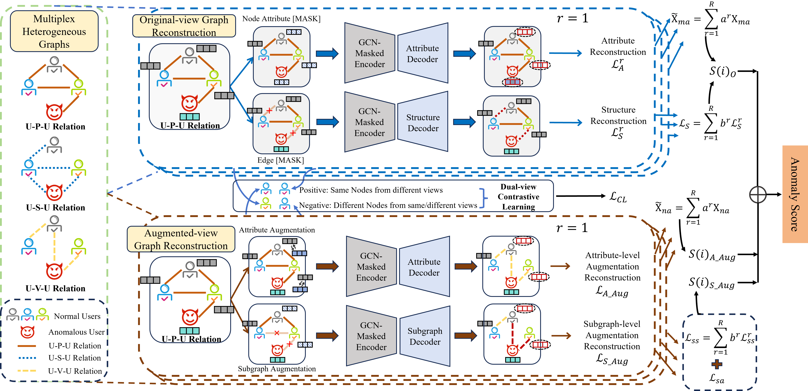

# UMGAD

This is the code for paper:
> UMGAD: Unsupervised Multiplex Graph Anomaly Detection

## Framework

We propose a novel framework named UMGAD for unsupervised graph anomaly detection tasks. By integrating graph autoencoders with diverse masking strategies across multiple relation types, UMGAD captures rich anomaly signals while suppressing redundancy. It leverages attribute and structure reconstruction in the augmented view, followed by anomaly aggregation via dual-view contrastive learning, ensuring robust detection.

## Dependencies
Recent versions of the following packages for Python 3 are required:
* networkx==2.8.4
* numpy==1.22.3
* PyYAML==6.0.1
* Requests==2.31.0
* scikit_learn==1.2.2
* scipy==1.10.1
* setuptools==60.2.0
* sphinx_gallery==0.15.0
* tensorboardX==2.6.2
* torch==1.10.1
* torch_cluster==1.6.0
* torch_geometric==2.2.0
* torch_sparse==0.6.13
* tqdm==4.65.0
* dgl==0.4.1

## Datasets
All of the datasets we use are publicly available datasets.
### Link
The used datasets are available at:
* Retail_Rocket https://tianchi.aliyun.com/competition/entrance/231719/information/
* Alibaba https://github.com/xuehansheng/DualHGCN
* Amazon https://github.com/YingtongDou/CARE-GNN/tree/master/data
* YelpChi https://docs.dgl.ai/api/python/dgl.data.html#fraud-dataset

Kindly note that there may be two versions of node features for YelpChi. The old version has a dimension of 100 and the new version is 32. In our paper, the results are reported based on the new features.

## Citation
If you find UMGAD useful in your research, please cite the following paper:
```bibtex
@article{li2024umgad,
  title={UMGAD: Unsupervised Multiplex Graph Anomaly Detection},
  author={Li, Xiang and Qi, Jianpeng and Zhao, Zhongying and Zheng, Guanjie and Cao, Lei and Dong, Junyu and Yu, Yanwei},
  journal={arXiv preprint arXiv:2411.12556},
  year={2024}
}
```
